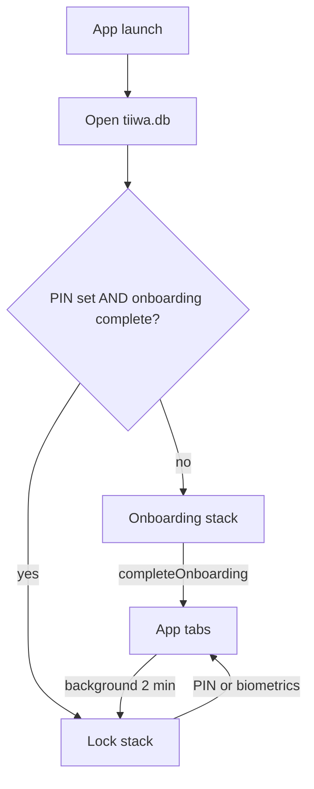
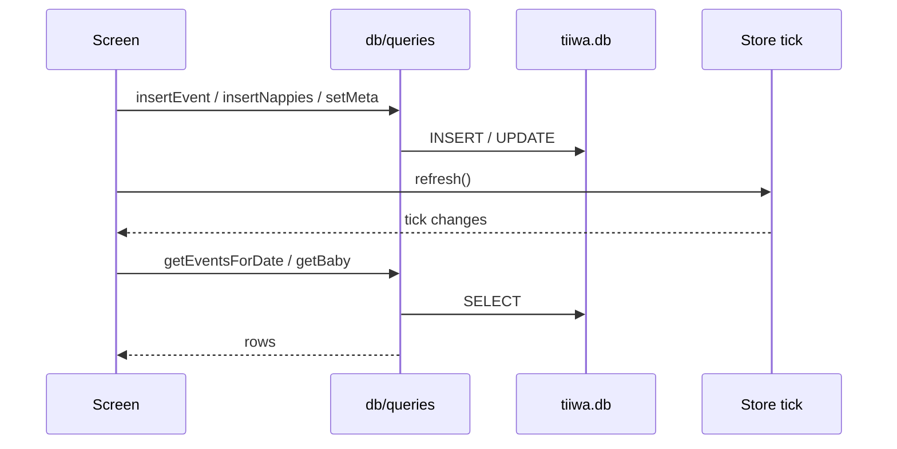
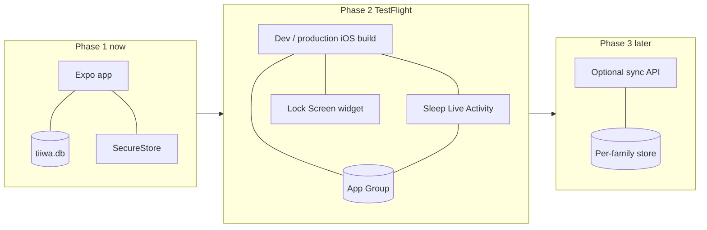

# Tiiwa architecture

Tiiwa is an offline-first baby-care log for one phone and one baby. The product job is logging a feed, sleep, or nappy in a few taps at 3am, then seeing today and the last week without leaving the device.

This file is the architecture advice: what the app is today, what must stay true, and how to grow it without breaking those rules.

## 1. Product constraints that drive the design

These are not optional preferences. They decide the stack.

| Constraint | Why it matters |
| --- | --- |
| Offline first | Night feeds happen without signal. Every write is local. |
| No account, no cloud in phase 1 | No Adonis, Postgres, or sync server until a later phase. |
| Device PIN is daily unlock | PIN is not email OTP. It never travels off the phone. |
| Email OTP is onboarding / recovery only | Optional endpoint; if unset, a one-time code is shown on device. |
| Logs stay on this phone | Privacy copy in Settings is a product promise, not marketing. |
| Expo SDK 57 | Read [docs.expo.dev/versions/v57.0.0](https://docs.expo.dev/versions/v57.0.0/) before adding native APIs. |
| Expo Go for current demos | Live Activities, widgets, and Face ID do not work in Expo Go. |

**Do not** introduce a backend, user accounts, or remote event storage to “make architecture complete.” That is a later phase with its own threat model.

## 2. What exists today (phase 1)

Phase 1 is a single Expo Router app. There is one process, one SQLite file, and one in-memory “refresh tick.”

```text
Phone
├── Expo Router UI
│   ├── (onboarding)  first-run: name → PIN → recovery email → OTP
│   ├── (lock)        daily PIN / Face ID, forgot-PIN recovery
│   └── (app)         Home, Insights, Settings + log/sleep modals
├── AuthProvider      status: loading | needs-onboarding | locked | ready
├── StoreProvider     tick + refresh() after writes
├── expo-sqlite       tiiwa.db  (babies, events, meta)
└── expo-secure-store PIN hash, OTP hash, biometrics flag
```



### 2.1 Layers

Keep new code in the same layers. Do not let screens talk to SQLite SQL strings.

| Layer | Lives in | Owns |
| --- | --- | --- |
| Routes | `app/` | Navigation, protected stacks, screen composition |
| Auth | `auth/` | PIN, OTP, biometrics, `AuthStatus` |
| Domain queries | `db/queries.ts`, `db/types.ts` | Baby, events, meta, CSV, day stats |
| Persistence | `db/client.ts` | Open DB, migrate schema |
| Time | `lib/dates.ts` | Local ISO, date keys, time periods |
| UI kit | `components/`, `theme/colors.ts` | Sunny Meadow, pads, charts, rows |
| Secrets | `lib/secure.ts` | SecureStore on native, `localStorage` on web |

`lib/store.tsx` is not a data store. It is a version counter. After any write that Home or Insights should see, call `refresh()`. Screens re-read SQLite when `tick` changes.

### 2.2 Auth is a gate, not an identity system

There is no user id. “Logged in” means **this phone has a PIN and finished onboarding**.

| Mechanism | Store | Purpose |
| --- | --- | --- |
| Device PIN | SHA-256 hash + salt in SecureStore | Daily lock after launch and after 2 minutes in background |
| Face ID / biometrics | SecureStore flag + `expo-local-authentication` | Optional unlock. Works in a dev/TestFlight build, not Expo Go |
| Recovery email | `meta.email`, `meta.email_verified` | Forgot-PIN path only |
| OTP | Hashed code + expiry in SecureStore | Prove the email during onboarding or recovery. 10 minute TTL |

Daily unlock never uses the email. If `EXPO_PUBLIC_OTP_ENDPOINT` is set, `sendOtp` POSTs `{ email, purpose, code }` to that URL. If it is unset, the code is shown once on the device so demos still work.

`AuthProvider` maps that to Expo Router `Stack.Protected` guards:

- `needs-onboarding` → `(onboarding)`
- `locked` → `(lock)`
- `ready` → `(app)` plus `log` and `sleep` modals

### 2.3 Data model

One baby per install. Events are append-mostly. Deletes are soft (`deleted_at`).

```text
babies
  id, name, date_of_birth, created_at, updated_at

events
  id, baby_id, kind, occurred_at
  time_precision   exact | period | unknown
  time_period      before_daybreak | morning | midday | afternoon | evening | night
  payload          JSON string
  notes, created_at, updated_at, deleted_at

meta
  key, value       onboarding, email, live timers, demo seed version
```

`kind` and `payload` pairs:

| kind | payload |
| --- | --- |
| `feed` | `{ method: 'breast' \| 'bottle', minutes }` |
| `sleep` | `{ startedAt, endedAt, minutes }` |
| `nappy` | `{ type: 'wet' \| 'dirty' \| 'both', colour? }` |

`occurred_at` is always a local ISO string (`YYYY-MM-DDTHH:mm:ss`), never UTC. Insights and Home group by `substr(occurred_at, 1, 10)`. Sleep that crosses midnight is attributed to the end day. Same-calendar-day sleep bands drive the Home rhythm chart; overnight spans do not draw a band.

Time precision is a first-class product rule, not a display hint:

- **exact** — clock time
- **period** — one of six parts of day; `occurred_at` is snapped to that period’s hour so the row still sorts
- **unknown** — “caught up later”; still stored on a day so Insights can show it

### 2.4 UI surfaces

| Surface | Job |
| --- | --- |
| Home | Today only: live sleep orb, log pills, rhythm chart, counts |
| Insights | Last 7 days chart (fixed) + that day’s timeline (scrolls). Tap a day on the chart to load its log |
| Settings | Baby profile, demo reload, CSV export, biometrics, recovery email, lock now |
| Log modal | Feed (breast/bottle + optional timer) or nappy (type, qty, colour, precision) |
| Sleep modal | Start / end a session. Start time lives in `meta.sleep_started_at` until end writes an event |

Timers (`sleep_started_at`, `feed_started_at`) are **in-progress state**, not events. An event exists only after the parent stops and saves.

### 2.5 Demo seed

`db/seed.ts` writes a Tiwatayo week (feeds, sleep, nappies, all precisions and periods) when `meta.demo_seed` is not `tiwatayo-1`. Settings can force-reload it.

**Remove auto-reseed from `refreshAuth` before any real parent uses the app.** Auto-replace on launch is correct for demos and destructive for real logs. Production should seed only on first empty onboarding, or behind an explicit Settings action.

## 3. Runtime data flow



Rules:

1. Screens never open a second database handle. Always `getDb()` from `db/client.ts`.
2. All user-visible times are local. Do not convert to UTC for storage.
3. Soft-delete only from Insights long-press. Hard `DELETE` is reserved for demo reseed.
4. CSV export is a read of `getAllEvents`. It is not a backup format we sync.

## 4. Recommended target architecture

Stay single-device until the App Store build is real. Grow **outward from the phone**, not toward a server.



### Phase 1 — shippable local product (current)

Done when a parent can onboard, lock, log three kinds, see today and a week, export CSV, and recover a PIN. No new product surface until this is stable without the demo seed wiping data.

Work left in this phase:

- Gate demo seed so it cannot replace a real log
- Keep one-baby, one-phone
- Treat web as a preview, not a supported client (SecureStore falls back to `localStorage`)

### Phase 2 — native shell (dev build / TestFlight)

Leave Expo Go. Add `expo-dev-client` + EAS. This unlocks Face ID for real and `expo-widgets`.

**Live Activity = active sleep only.** Start on **Start sleep**, show elapsed time on the Lock Screen and Dynamic Island, end on **End sleep**. Ask for the system Live Activity permission at that first Start sleep, not in onboarding.

**Lock Screen widget (optional, after the activity) = last feed / last nappy.** That is the all-day glance. Do not fake “last fed 2h ago” as a Live Activity; iOS expires activities after ~8 hours.

Lock-screen **logging** (`+` that writes a nappy without opening the app) is a third step:

1. Widget / activity button writes a small JSON job into an App Group
2. Main app (or a short background wake) ingests the job into SQLite
3. The widget cannot import `db/queries` or open `tiiwa.db` itself

Until that ingest exists, a tap on the activity should deep-link to `tiiwa://sleep`. The PIN still applies when the app opens. That is acceptable for v1 of the activity.

Live Activity UI may be dark even though the app stays Sunny Meadow. It sits on a lock-screen wallpaper and needs contrast.

Do **not** add push-to-update Live Activities in phase 2. That needs APNs and a server. Local `start` / `update` / `end` from the sleep modal is enough.

### Phase 3 — optional sync (only if families ask)

If two caregivers need the same log:

- Keep SQLite as the source of truth on each device
- Add an outbox table (`sync_id`, `op`, `payload`, `acked_at`)
- Server is a dumb event log per family, not a place UI queries live
- Conflict rule: last write wins on the same `sync_id`; never invent merges for nappies
- PIN and OTP stay on-device; the server authenticates a family, not a daily unlock

Do not start phase 3 to “be ready.” Start it when a second device is a real requirement.

## 5. Folder map (keep this shape)

```text
app/
  _layout.tsx          Auth + Store + protected stacks
  (onboarding)/        welcome, profile, set-pin, email, otp
  (lock)/              PIN, recover-email, recover
  (app)/               index (Home), insights, settings
  log.tsx              feed / nappy modal
  sleep.tsx            sleep modal
auth/                  AuthProvider, pin, otp, biometrics
db/                    client, queries, types, seed
lib/                   dates, secure, store, toast
hooks/                 useBaby, useElapsed
components/            PinPad, charts, TimelineRow, ui
theme/colors.ts        Sunny Meadow tokens only
```

New features:

- A new event kind → `db/types.ts` + `insertEvent` + one log UI. Do not add a second events table.
- A new native surface → `widgets/` (or equivalent) compiled with the `'widget'` directive. Isolated runtime: no React hooks, no SQLite, no app context.
- A new secret → `lib/secure.ts` only. Never put PIN or OTP in `meta`.

## 6. Non-goals

- Multi-baby in phase 1 (schema allows it; product does not)
- Medical advice, percentiles, or “is this normal?”
- Photos, location, contacts, advertising IDs
- Android widgets before the iOS sleep Live Activity is shipping
- Rewriting the app in Swift or as a PWA
- Using Live Activities as a permanent dashboard

## 7. Decision log

| Decision | Choice | Rejected |
| --- | --- | --- |
| Client | Expo SDK 57 + Expo Router | PWA, bare Swift, Capacitor |
| Persistence | expo-sqlite on device | Remote DB in phase 1 |
| Unlock | Local PIN (+ optional biometrics) | Email OTP as daily lock |
| Recovery | Email OTP, hashed on device | Security questions, SMS |
| Time | Local ISO strings + precision enum | UTC timestamps only |
| Insights | One screen: week chart + day list | Separate Day / Trends tabs |
| Glance (future) | Sleep Live Activity, then lock-screen widget | Always-on “hours since last feed” activity |
| Sync (future) | Outbox + family event log | Live query against a server |
